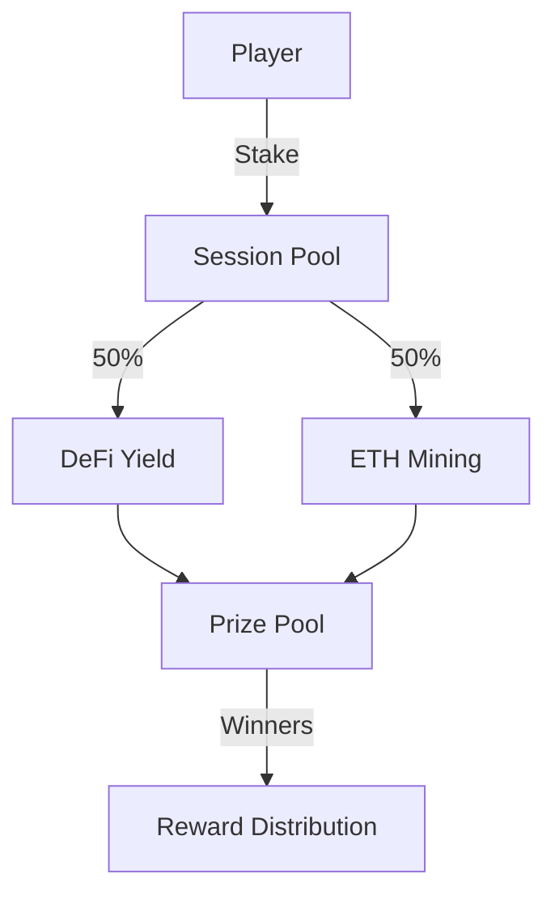

# XENOYIELD

> A DeFi-powered competitive space exploration game

The Next Frontier: 2024-2050

As humanity stands on the brink of becoming a multi-planetary species, the next three decades promise unprecedented achievements in space exploration:

2024-2030:
*Permanent lunar settlements through NASA's Artemis program
*First commercial space stations
*Initial Mars cargo missions laying groundwork for human arrival

2030-2040:
First human settlement on Mars
Asteroid mining operations begin
Deep space habitats between Earth and Mars
Commercial lunar economy emerges

2040-2050:
Regular transit between Earth and Mars
Discovery of potentially habitable exoplanets
Advanced propulsion enabling deeper space exploration
First commercial operations beyond Mars
XENOYIELD anticipates this exciting future by gamifying space exploration through blockchain technology. As humanity reaches for the stars, our protocol creates a unique bridge between DeFi yields and the thrill of cosmic discovery.

XENOYIELD is a unique blockchain game that combines third-person combat mechanics with DeFi yield generation. Players stake assets to participate in timed expeditions on tokenized exoplanets, where survival and combat prowess directly impact financial returns.

## 🚀 Quick Start

### Prerequisites

- Node.js (v16 or higher)
- MetaMask wallet
- Git

### Installation

```bash
# Clone the repository
git clone https://github.com/yourusername/xenoyield.git

# Install dependencies
cd xenoyield
npm install

# Set up environment variables
cp .env.example .env
# Edit .env with your configuration

# Start local development
npm run dev
```

## 🎮 How to Play

### 1. Connect & Stake

- Connect your MetaMask wallet
- Choose an expedition session (20-50 minutes)
- Stake your assets (minimum 0.1 ETH)

### 2. Explore & Combat

- Navigate exoplanets in third-person view
- Mine resources to increase yields
- Engage in PvP combat
- Survive to maximize returns

### 3. Rewards

- Claim rewards during docking periods
- Earn exoplanet NFT properties
- Generate passive income through mining

## 💀 Risk Levels

| Zone Type   | Stake Loss | Potential Yield |
| ----------- | ---------- | --------------- |
| Low Risk    | 10-20%     | 1x-2x           |
| Medium Risk | 30-50%     | 2x-5x           |
| High Risk   | Up to 90%  | 5x-10x          |

## 🏗 Architecture



### Smart Contracts

- `SessionController.sol`: Manages game sessions
- `YieldManager.sol`: Handles DeFi integrations
- `ExoplanetNFT.sol`: NFT property system
- `MiningController.sol`: ETH mining allocations

## 💎 Key Features

- **AI-Driven Yield**: Automated yield optimization
- **Real Exoplanets**: NFT properties based on actual celestial bodies
- **Dynamic Rewards**: Performance-based yield distribution
- **Ghost Mode**: Spectate after elimination
- **Mining Integration**: ETH mining reward sharing

## 🔧 Technical Stack

- Frontend: React/Next.js
- Blockchain: Mantle Network
- 3D Engine: Unity
- Smart Contracts: Solidity

## ⚡ Why Mantle Network?

XENOYIELD leverages Mantle's Layer 2 infrastructure to provide a superior gaming experience:

| S Feature         | Benefit                 | Impact                  |
| ----------------- | ----------------------- | ----------------------- |
| Transaction Speed | <1 second finality      | Smooth gameplay         |
| Gas Costs         | ~95% reduction          | Lower barriers to entry |
| NFT Operations    | Instant minting/trading | Active marketplace      |
| Scalability       | High throughput         | Large player base       |

Integration Architecture

graph TD
A[Player Actions] -->|Mantle L2| B[Session Contract]
B -->|Fast Finality| C[Game State]
C -->|Low Gas| D[NFT Updates]
D -->|Quick Sync| E[Reward Distribution]

## 📈 Revenue Model 💰

1. **Player Fees**

   - Elimination penalties
   - Transaction fees
   - NFT marketplace fees

2. **Yield Sources**
   - DeFi protocol yields
   - ETH mining rewards
   - Property rental income

## 🛡 Security

- Multiple contract audits
- Secure stake management
- Regular security updates

## 🤝 Contributing

1. Fork the repository
2. Create feature branch (`git checkout -b feature/AmazingFeature`)
3. Commit changes (`git commit -m 'Add AmazingFeature'`)
4. Push to branch (`git push origin feature/AmazingFeature`)
5. Open a Pull Request

## 📄 License

Distributed under the MIT License. See `LICENSE` for more information.

## 📞 Support

- [Telegram](https://t.me/blessedux)
- Twitter: [@XenoYield](twitter-link)
- Email: joaquin@mentemaestra.space

## ⚠️ Disclaimer

This is a high-risk game involving real assets. Please play responsibly and never stake more than you can afford to lose.

---

Made with 🚀 by the blessedux for the Sozu Hack #2 Feb 2025
